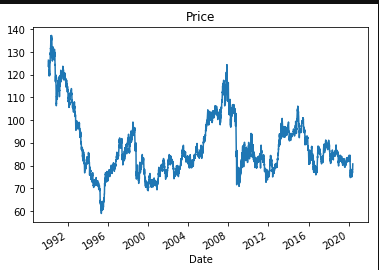
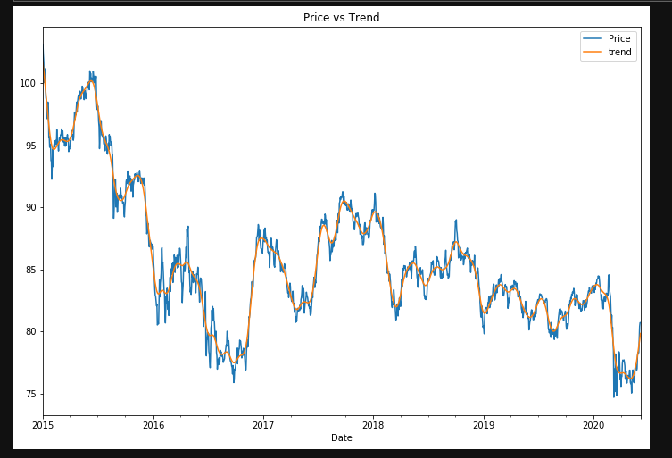
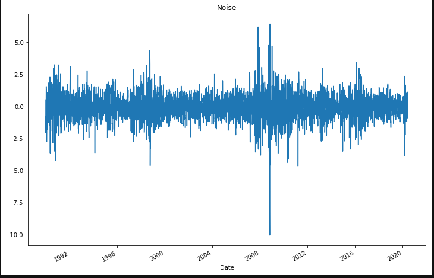
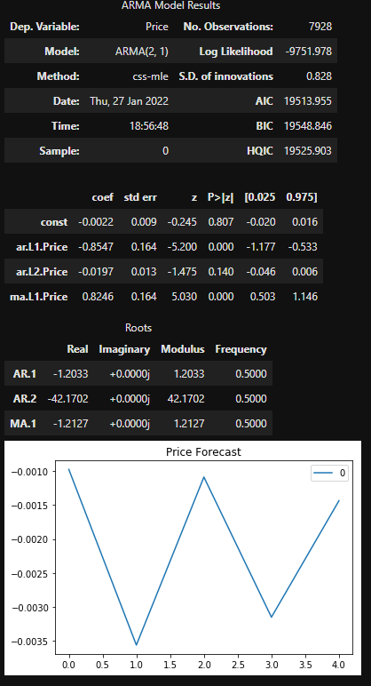
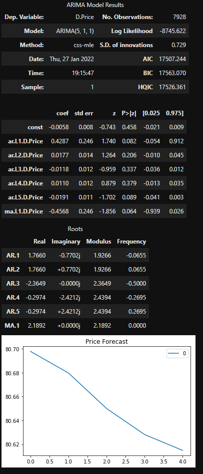
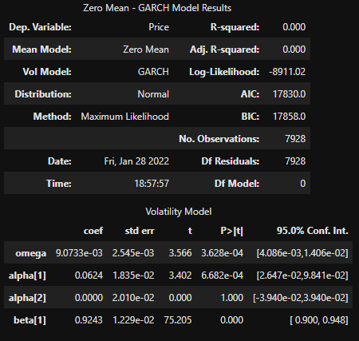
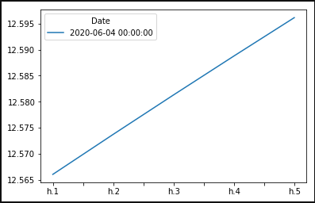
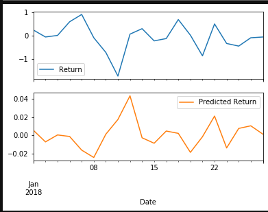
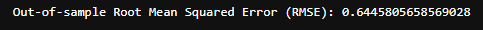
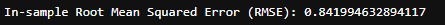

# A Yen For The Future Summary

# Models and Findings Summary 
* In Summary this analysis tool was created to predict future movements in the value of the Canadian dollar versus the Japanese yen. 
* After completion of all the time series tools, the analysis tool was ready to be reviewed. 
* In review it can be found that the models indicate a decrease in value of the YEN on a 5 day forecast and a higher volatility predicted for the same days. This would indicate to the user not to buy at this stage but to wait for the predicted drop to stop. 
* After reviewing the RMSE for in sample and out of sample as well as the P-value. It can be concluded that this isn't the most accurate model that could be used and would need refining and manipulating to be more reliable and valid. 

---
# Time Series Analysis Notebook
   * Initial Time-Series Plotting
    
   * This Plot shows the historical CAD-Yen exhange rate from 1990 to 2021. Can be used to predict trends and patterns for future forecasting.
---
   * Decomposition Using a Hodrick-Prescott Filter (Exchange Rate Price vs. the Trend for 2015 to the present)
    
   * This Plot shows the exhange rate price percentage change for CAD-YEN from 2015 to present vs the trend for the same period. 
   * This model shows the trend line following the exchange rate with a smoother line which is expected. 
---
   * Plot the Settle Noise
    
   * This Plot shows us the variance on a scale from 1990 to 2021, This will allow us to understand the variance after smoothing with the trend model. 
---
   * ARMA Model and the forecasted return for the next 5 days
    
   * The ARMA model as shown above is used to forecast 5 days worth of price predictions for the CAD-YEN exchange rate. It will use the percentage change of the exhange rate. This ARMA model portrays the P-value being greater than the significance level, indicating the we cannot conclude that the coefficient is statistically significant. As seen in the plot as well it is a W shape and has no price relevance and cannot be used. 
---
   * ARIMA model and the 5 day Forecast 
    
   * The ARIMA model will also forecast 5 days worth of price predictions for the CAD-Yen exchange rate. It will use the raw price of the exhange rate. This model also portrays the P-value being greater than the significance level, indicating the we cannot conclude that the coefficient is statistically significant. Although the plot it produces is interpretable just not fully reliable and trustworthy. It indicates the price of the CAD-YEN will consistently decrease in the 5 days forecast. This gives the information to not buy at this stage, to wait and forecast after 5 days again for a possible upwards trend. 
---
   * Garch Model and the final 5 day Forecast 
   
    
   * The Garch model will use the percentage change of the CAD-YEN exchange rate. This model is used to forecast 5 days worth of volatility in the CAD-YEN exchange rate price. As the plot indicates the volatility will increase consistently over the forecasted 5 days. 
   * The Garch model produced possess good P-value scores in almost all areas just not Alpha(2). This shows good performance in the model and can be used more reliably and is more trustworthy. 
---
# Regression Analysis Notebook
   * Plot of first 20 predictions vs the true values
    
   * The linear regression model will be used to create train and test models for predicting returns for the CAD-YEN. 
   * As we can see from the plot above the predicted returns compared to the actual returns ends at a similar price, but doesn't follow the same trend entirely. It has positive spikes when there is drops and drops when there is positive spikes indicating that this model is not accurate and therefore not reliable to trust in making a purchase off predicted returns. 
---
   * Out of sample performance 
    
   * The out of sample performance for this linear regression model is very low as seen meaning the model is not so reliable and will produce incorrect results. 
---
   * In sample performance
    
   * The in sample performance for this linear regression model is .2 higher or 20% higher than the out of sample, telling us it is more relaible and accurate when producing predictions. 
---